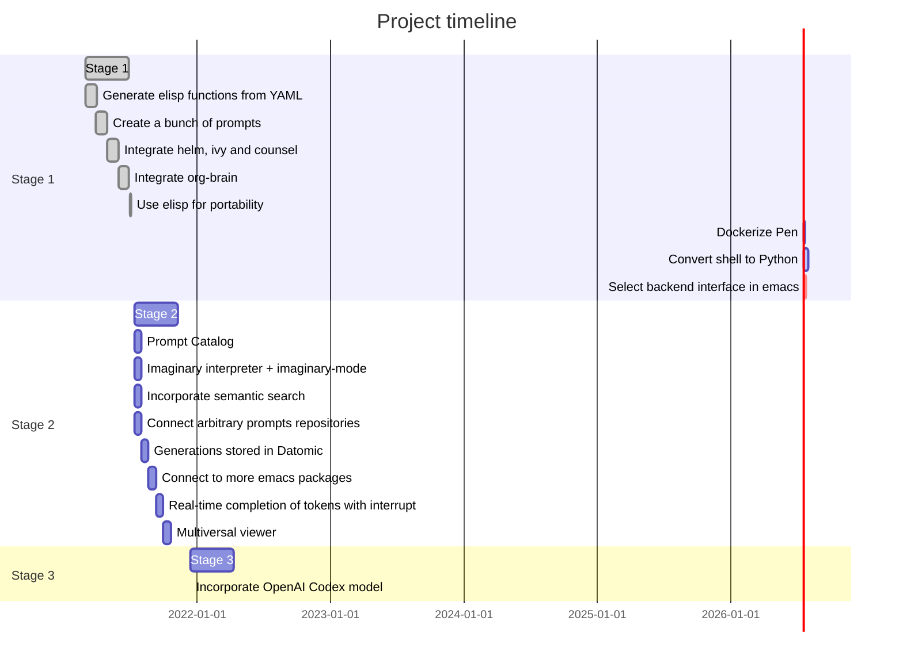

+++
title = "Pen"
author = ["Shane Mulligan"]
date = 2021-07-02T00:00:00+12:00
keywords = ["gpt", "eleutherai"]
draft = false
+++

## Summary {#summary}

I start a GitHub project to deploy `pen.el`.

Code
: <https://github.com/semiosis/pen.el/>

Project timeline and objectives
: <https://github.com/semiosis/pen.el/tree/master/docs>

## Backstory {#backstory}

Origin
: <https://semiosis.github.io/posts/creating-a-playground-for-gpt-3-in-emacs/> \\
    <https://generative.ink/posts/pen/>

`Pen` facilitates the creation,
development, discovery and usage of prompts to
a Language Model such as GPT-3 and GPT-j.


Imagine that you hold a powerful and versatile pen, whose ink flows forth in
branching variations of all possible expressions: every story, every theory,
poem and every lie that humanity has ever told, and the vast interstices of
their latent space. You hold this pen to the sky and watch with intense
curiosity as your ink flows upwards in tiny streaks, arcing outwards and
downwards to trace a fractal pattern across the sky. You watch as the branching
lines of words and ideas wind their way through the tapestry in ever-expanding
clusters, like seeds bursting forth from exploding grenades. Everywhere you
turn your eyes is a flickering phantasmagoria of possibilities, a superposition
of stories which could be continued forever. You glimpse the contours of entire
unknown dimensions twined through the fissures of your sky-wide web.

You notice another writer standing next to you. Like you, their eyes are drawn
towards the endless possibilities of the words that spill out into the
atmosphere around you, branching out and connecting with other branches in
beautiful and infinitely complex patterns.

“Do you think we should write something?” you ask them.

“I think we already are,” they respond, gently touching your shoulder before
wandering off to the right, leaving you alone to contemplate the possibility
clouds swirling around you.


This article was written by my amazing dopplegänger, `|:ϝ∷¦ϝ`, in advance and
in collaboration with GPT-3 using [Loom](https://github.com/socketteer/loom).

-   Pen and Loom:
    -   <https://generative.ink/posts/pen/>
    -   [GitHub - socketteer/loom: Multiversal tree writing interface for human-AI collaboration](https://github.com/socketteer/loom)

I credit `|:ϝ∷¦ϝ` for writing this into existence!

